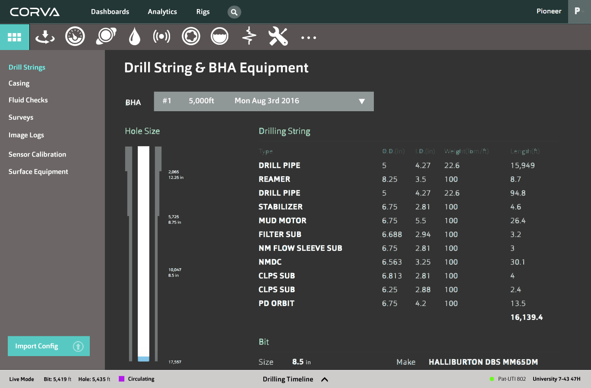

This list is assumed to be in priority order. Next work items will be taken from
the top of the list unless agreed otherwise.

## Dashboard and Widget API (read)

Adds capability for dashboards, well pages, and their contents to be populated dynamically based on user settings in serverside database.

* Specify the API.
* Read the list of dashboards and their contents from the API.
* Populate the dashboard based on information received from the API.

## Dashboard and Widget API (write / update)

Adds capability for users to change their dashboard and well page layouts and
have them persisted to their settings in the serverside database.

* Writing updates to API when the user resizes or reorganizes a dashboard.

## Well Page Timeline Bar

Adds capability for users to adjust the time displayed in widgets placed
on well pages.

* Take and adapt the existing implementation in the corva-web develop branch
  if possible.
* If this proves impossible, probably needs a bespoke component.

## Building For Deployment

Adds capability for the project to be built to production so that it can be deployed as part of `corva-web`.

* Modify frontend build configuration so that paths etc. are compatible.
* Integrate deployment with `corva-web` deployment process.

## Interoperation With corva-web Pages

Adds capability for the new frontend to seamlessly interoperate with the navigation structure of the existing `corva-web`.

* Modify `corva-web` layouts and views to use the new frontend.
* Modify `corva-web` routing configuration to support the new frontend navigation (HTML5 pushState).
* Support old-style well pages.
* Support old-style user settings pages.
* Support old-style static pages.

## Adding A Widget

Adds capability for a user to add widgets to Dashboards and Well pages.

* Listing available widget types.
* Adjusting the Widget settings. (Rig, other common and widget-specific settings)
* Persisting the addition to the Dashboards API.

## Removing A Widget

Adds capability for a user to remove a widget from their Dashboard or Well page.

* Persisting the removal to the Dashboards API.

## Widget Settings

Adds capability for a user to change the settings of a widget that they have previously added.

* Should use the same settings feature as already implemented in "Adding A Widget".
* Adjusting the Widget settings. (Rig, other common and widget-specific settings)
* Persisting the addition to the Dashboards API.

## Dashboard Management

Adds capability for users to to manage multiple dashboards.

* UI support for multiple dashboards in navigation.
* Create a dashboard.
* Delete a dashboard.
* Rename a dashboard.

## Widget Loading States

Most widgets will need to load data. While data is loading, some loading/progress indication needs to be shown to the user. Add a capability for doing this in a consistent way across widget types, so this does not needs to be implemented for every widget.

* Loading indication support in the widget API.
* UI design and implementation for the loading state.

## Full-Screen Widgets

Adds a capability for users to expand any widget to full-screen mode.

* Must also be linkable, i.e. a URL that points directly to a full-screen widget. Supports opening a widget to another browser tab/window.

## Fully-Featured T&D Broomstick

Extend the simplistic T&D Broomstick widget to contain all the features that it will have.

**Needs further specification**

## Bootstrap Theme

Adds capability for using Bootstrap (react-bootstrap) components in widgets without
needing significant CSS styling every time.

* Evaluate existing themes to see if there is one that can be used as basis.
* Based on evaluation, either adapt an existing theme or create one from scratch.

## Rig Listings

Adds the capability for users to list rigs, wells, and drilling programs, and to navigate to them.

**Needs further specification**

## Well Alerts Bar

Adds the capability for users to see alerts on the well pages.

**Needs further specification**

## Analytics Dashboards

**Needs further specification**

## Search

Adds the capability for users to search for rigs and wells.

**Needs further specification**

## Engagement Tracking

Adds the capability for Corva to track what users are doing in the system.

* Evaluate tracking service options (Google Analytics, others.)
* Specify and implement tracking for the interactions we want to track.
  * E.g. on top of basic navigation tracking, track interaction with widgets.

## Dashboard Sharing

Adds the capability for users to search with other users the dashboard they have made.

**Needs further specification**

## Messages

**Needs further specification**
 
## Third-Party Widget Integration

Adds the capability for Corva customers to integrate widgets of their own making into dashboards.

* Options include light-weight iframe integration of arbitrary HTML content, and deeper integration of actual JavaScript widgets that conform to a specific JavaScript API. Different options have different tradeoffs.

**Needs further specification**

## Native Mobile App Integration

Adds the capability for widgets to be displayed in WebViews inside native mobile applications.

**Needs further specification**

