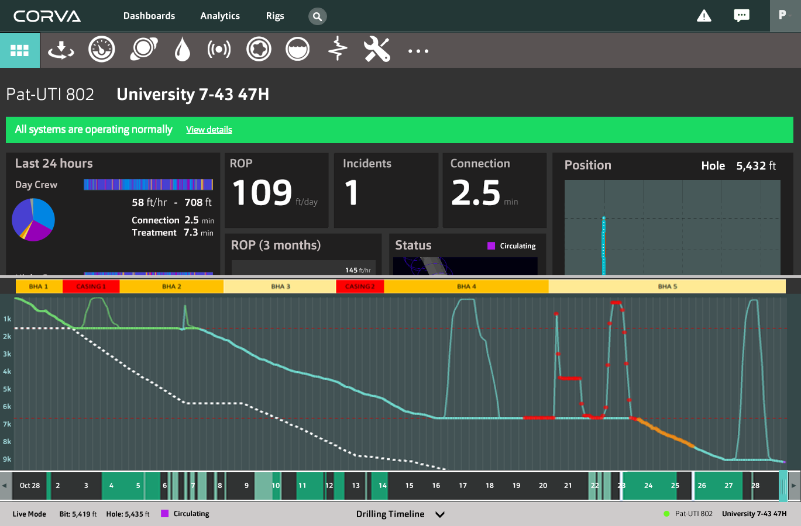

This list is assumed to be in priority order. Next work items will be taken from
the top of the list unless agreed otherwise.

## Adding An App

Adds capability for a user to add apps to Dashboards and Well pages.

* Listing available app types.
* Adjusting the App settings. (Rig, other common and app-specific settings)
* Persisting the addition to the Dashboards API.

## App Settings

Adds capability for a user to change the settings of a app that they have previously added.

* Should use the same settings feature as already implemented in "Adding An App".
* Adjusting the App settings. (Rig, other common and app-specific settings)
* Persisting the addition to the Dashboards API.

## Requesting Historical Data

On asset pages with control components such as the Well Timeline, sometimes we're not showing real-time data. In these cases, apps should get historical data with a regular HTTP call instead of subscribing to `corva-subscriptions`.

Come up with a generic way of doing this, so that it works with all apps and different kinds of "control apps" in the same way.

## Building For Deployment

Adds capability for the project to be built to production so that it can be deployed as part of `corva-web`.

* Modify frontend build configuration so that paths etc. are compatible.
* Integrate deployment with `corva-web` deployment process.

## Dashboard Management

Adds capability for users to to manage multiple dashboards.

* UI support for multiple dashboards in navigation.
* Create a dashboard.
* Delete a dashboard.
* Rename a dashboard.

## App Loading States

Most apps will need to load data. While data is loading, some loading/progress indication needs to be shown to the user. Add a capability for doing this in a consistent way across app types, so this does not needs to be implemented for every app.

* Loading indication support in the app API.
* UI design and implementation for the loading state.

* When the whole app is loading - Should we do no loader here and instead rely on the page loader?
* When the current page is loading - I think singe centered spinner within page view - maybe like the last one on http://tobiasahlin.com/spinkit/  - as in creating the dashboard
* When the data for an individual app is loading - I think this is a general loading state for every app. Can this happen from our framework? It should be a loader maybe similar to above or different.

## Full-Screen Apps

Adds a capability for users to expand any app to full-screen mode.

* Must also be linkable, i.e. a URL that points directly to a full-screen app. Supports opening a app to another browser tab/window.

## Fully-Featured T&D Broomstick

Extend the simplistic T&D Broomstick app to contain all the features that it will have.

**Needs further specification**

## Fully-Featured Well Timeline with Real Data

Ryan:

> We will need a method to gather the data for the well timeline. Since we are moving to Cassandra, I think we will create a summary cache that suits our timeline. For example, if we collect in 1 second increments, the summary will aggregate for every 1 minute, 5 min, 1 hour, etc
ActivityGroupItem = "Drilling" or "Tripping In" - it's an larger value of activity states. We will put this in the WitsRecord in the future so everything is in 1 record. We need a query method to get this 
data. TBD.

## Bootstrap Theme

Adds capability for using Bootstrap (react-bootstrap) components in apps without
needing significant CSS styling every time.

* Evaluate existing themes to see if there is one that can be used as basis.
* Based on evaluation, either adapt an existing theme or create one from scratch.

Use IBM Bluemix as an inspiration.

## Rig Listings

Adds the capability for users to list rigs, wells, and drilling programs, and to navigate to them.

**Needs further specification**

## Synchronized Mouseover on charts

Support a UX feature where a use can mouseover on data points in graphs, and data points from the same time are also higlighted on other graphs.

## Depth vs. Time Chart for Well Timeline

In addition to the basic well page timeline already implemented, the mockup contains a "depth vs time" chart displayed above it:

## Well Alerts Bar

Adds the capability for users to see alerts on the well pages.

**Needs further specification**

## Analytics Dashboards

**Needs further specification**

## Search

Adds the capability for users to search for rigs and wells.

**Needs further specification**

## Engagement Tracking

Adds the capability for Corva to track what users are doing in the system.

* Evaluate tracking service options (Google Analytics, others.)
* Specify and implement tracking for the interactions we want to track.
  * E.g. on top of basic navigation tracking, track interaction with apps.

## Raw Traces

Shows the raw values, supports zoom, scroll, and customization.
This is also where we need a socket to stream in live data.
Considered to be a component so a subset of the traces can be embedded in other views.

## Dashboard Sharing

Adds the capability for users to search with other users the dashboard they have made.

**Needs further specification**

## Messages / Chat

**Needs further specification**
 
http://josephndungu.com/tutorials/gmail-like-chat-application-in-ruby-on-rails

## Third-Party App Integration

Adds the capability for Corva customers to integrate apps of their own making into dashboards.

* Options include light-weight iframe integration of arbitrary HTML content, and deeper integration of actual JavaScript apps that conform to a specific JavaScript API. Different options have different tradeoffs.

**Needs further specification**

## Native Mobile App Integration

Adds the capability for apps to be displayed in WebViews inside native mobile applications.

**Needs further specification**

